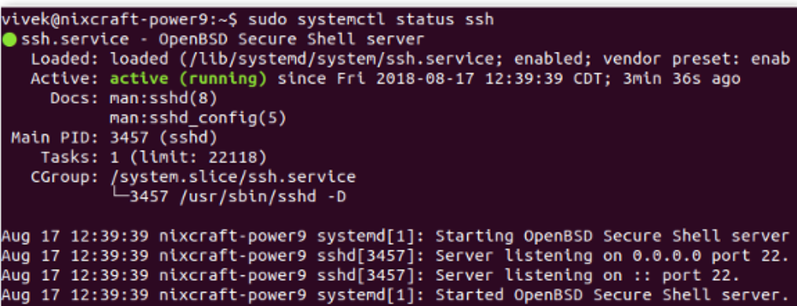

# Creating Remote Jupyter Server

Update & Upgrade System:\


```
sudo apt update
sudo apt upgrade
```

Install OpenSSH Server:\


```
sudo apt install openssh-server
```

Verify that ssh service running:\


```
sudo systemctl status ssh
```


<div align="left">



</div>

If not running enable the ssh server and start it as follows by typing the systemctl command:\


```
sudo systemctl enable ssh
sudo systemctl start ssh
```

\
You must configure the Ubuntu Linux firewall called ufw. Check https://www.cyberciti.biz/faq/ufw-allow-incoming-ssh-connections-from-a-specific-ip-address-subnet-on-ubuntu-debian/


```
sudo ufw allow ssh
sudo ufw enable
sudo ufw status
```

To connect:


```
ssh user@public-ip
```

Connecting 8888 to 8888 port for connecting Jupyter Notebook from the Local

```
ssh -L 8888:localhost:8888 username@ip_target_machine
```
